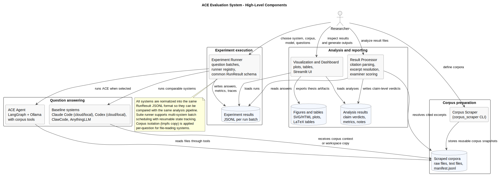
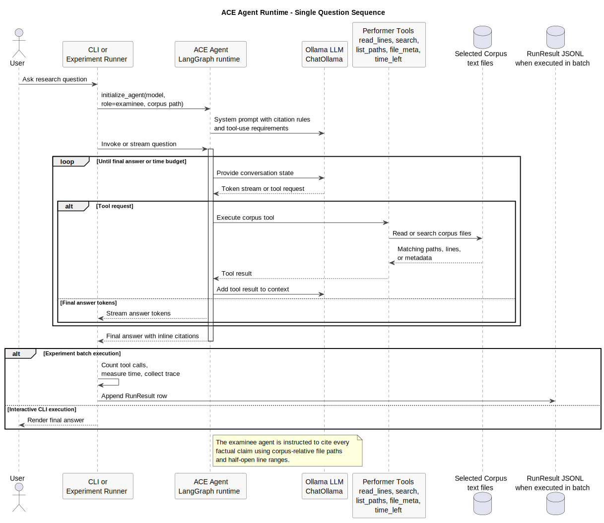
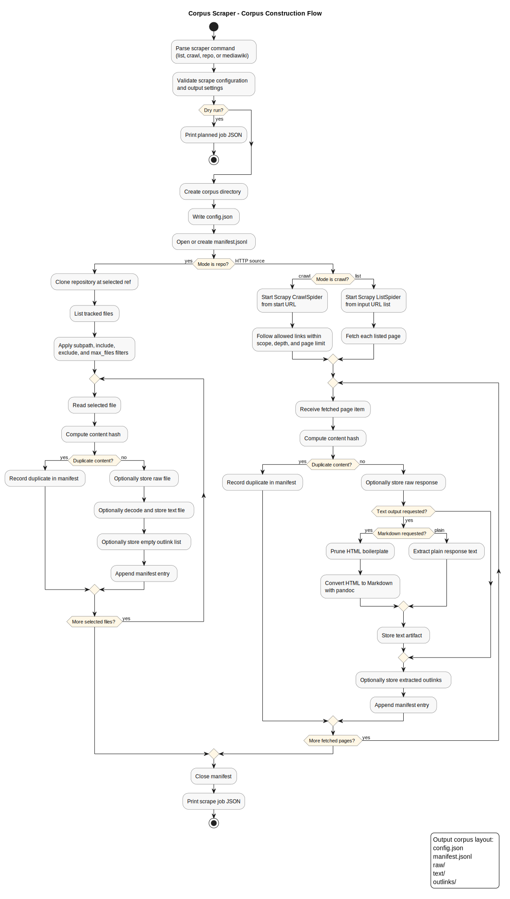
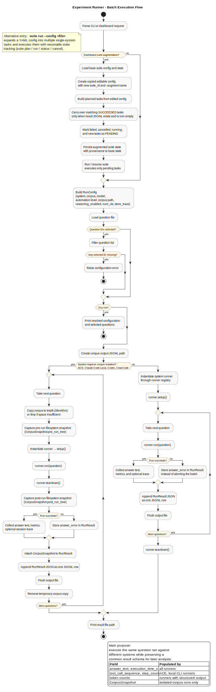
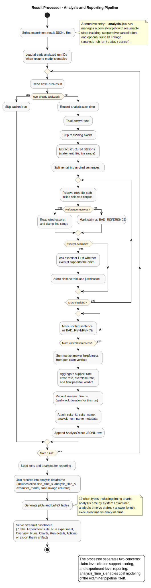
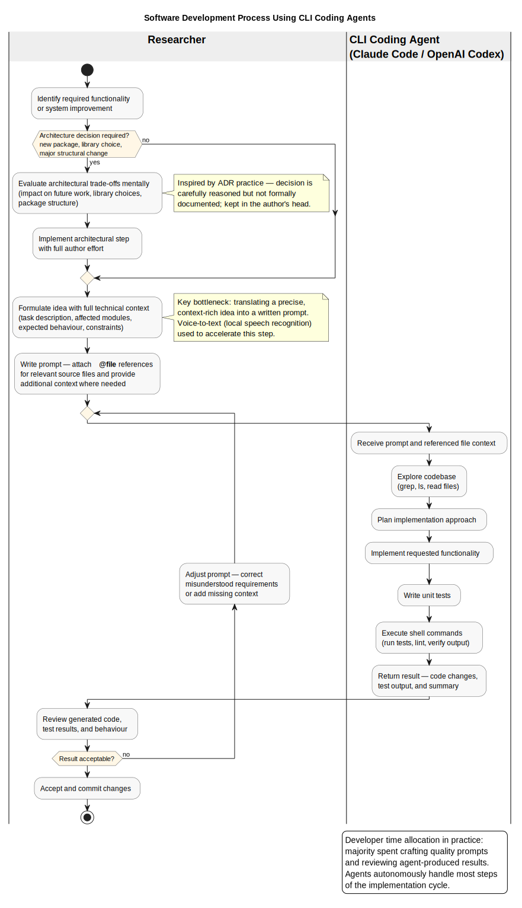

# agentic-context-engineering

# Software requirements:

- Python 3.10+
- uv, high performance python package manager (https://github.com/astral-sh/uv)
- Pandoc CLI tool (https://github.com/jgm/pandoc)
- Ollama (https://github.com/ollama/ollama/releases)
    - download a model with thinking and tool support `ollama pull {model_name}` (https://ollama.com/)
- Docker Desktop
    - for running the anythingLLM system (one of the baseline systems)
- Google Chrome for Plotly/Kaleido static PDF chart export
    - install with `uv run --package result-processor plotly_get_chrome`, or install Chrome manually for your operating
      system

# Setup guide

1. Clone this repository
2. create a python virtual environment using `uv` tool

```
uv sync --all-packages --all-groups
```

3. Acquire the core datasets

   **Option A: download pre-built snapshots from GitHub Releases (faster and deterministic):**

   ```
   make download_corpora
   ```

   **Option B: scrape from source (takes longer and online content could have changed over time):**

   ```
   make corpus_scraper_solar_system
   make corpus_scraper_oblivion
   make corpus_scraper_scipy
   ```

4. (optional) Launch the custom `ace` agent sample program

   ```
   make agent_test
   ```

5. To run the external baseline benchmark systems (`anythingllm`, `ChatGPT codex`, `Anthropic claude code`, `ClawCode`),
   you have to set them up on your computer - check the scripts in `./setup` directory. To run the custom `ace`
   agent, no extra installs on computer are necessary, except the uv environment install command `2.`

6. Launch the experiment runner and results dashboard. It is possible to import the example results found in (
   `./data/exports` directory in this repository)

   ```
   make dashboard
   ```

# Architecture diagrams

High-level PlantUML diagrams are stored in `docs/diagrams`. Generate them with:

```
make diagrams
```

### System overview



### Agent runtime sequence



### Corpus scraper flow



### Experiment runner flow



### Result processing pipeline



### AI coding workflow


